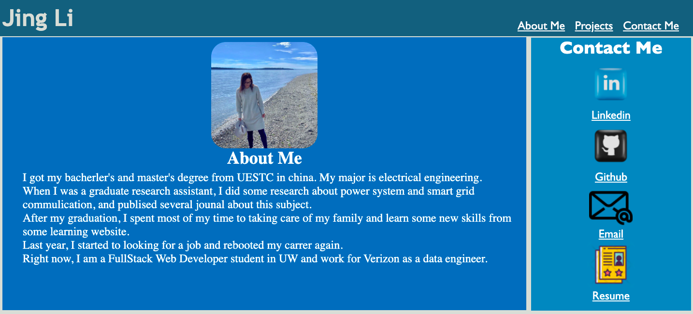

# Jing Li's Portfolio

This is Jing Li's portfolio aimed to showcase previous works.

## Description

Contains a recent picture, about me, projects and contact links

Navigation links scroll to their respeced sections

Responsive design adapts to various browser screen sizes

## How to Use the portfolio
When you click the about-me navbar, you will know something about me;
When you click the projects navbar, you will see several example projects developed by me;
When you click the contact me navbar, you will see some contact list which you can use to reach to me;
when you click the Linkedin anchor, you can get into the my linkedin page;
when you click the GitHub anchor, you can get into the my github page;
You can also send email to the me by clicking the email anchor or just click the resume anchor to download my resume directly.

## Live Link

https://jean424.github.io/update-portfolio/

